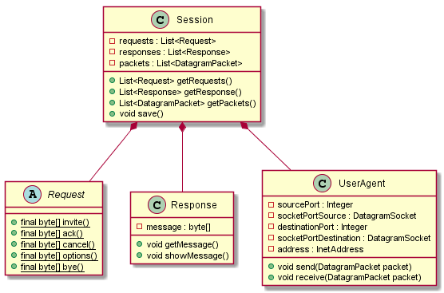

<!-- PROJECT LOGO -->
   
    

  
  <h1 align="center">VoIP UserAgent</h1>
  

    Java implementation of SIP UserAgent for a VoIP Communication.
  

  

    Maven Project, mjUA v1.8
  

  
  <!-- TABLE OF CONTENTS -->
  ## Table of Contents
  
  - [Table of Contents](#table-of-contents)
  - [About The Project](#about-the-project)
  - [SIP Requests](#sip-requests)
    - [INVITE](#INVITE)
    - [ACK](#ACK)
    - [BYE](#BYE)
  - [UML Diagrams](#uml-diagrams)
    - [Class Diagram](#class-diagram)
  - [Getting Started](#getting-started)
    - [Libraries](#Libraries)
    - [Updates](#updates)
  - [License](#license)
  - [Contributors](#contributors)
   
   <!-- ABOUT THE PROJECT -->
   ## About The Project
   **VoIP UserAgent** is a SIP Client UserAgent to use for a VoIP communication. It's a console 
   program that calls mjSIP User Agent and can capture the client's audio to send through the conversation.  
   
   The system is made up of a two DatagramSocket: one for the incoming responses, the other for the outcoming requests, 
   which are the core of the Client UserAgent. The application has a Session Recorder which is a sort of Logs Register: it records
   all the data (in byte) that flows through the conversation and save them as a string in an external file.
   
   Every request sent and response received is recorded in the Session Recorder.
   
   Moreover, once the call start the program capture the conversation in *.pcap* for it to be used for a better analysis using Wireshark.

   <!-- FOR GUI

    The system has a GUI that starts with the typical telephone interface with 2 buttons to take or hang up the call.
    
    - Press the green button to call the other mjUA UserAgent.
    
    - Once the conversation has start, you can change the dialog window to see the logs of the call, and see the requests 
       the application has sent and the responses it received.
    
    - You can hang up the call at any moment, by pressing the red button. This will send a BYE Request to the mjua,
       which will send a 200 OK response.

    -->
    
   
   <!-- SIP REQUESTS  -->
   ## SIP Requests

   ### INVITE
        INVITE sip:bob@127.0.0.1:5080 SIP/2.0
        Via: SIP/2.0/UDP 127.0.0.1:5070;branch=z9hG4bK5c3663b7
        Max-Forwards: 70
        To: "Bob" <sip:bob@127.0.0.1:5080>
        From: "Alice" <sip:alice@127.0.0.1:5070>;tag=691822153216
        Call-ID: 958219347383@127.0.0.1
        CSeq: 1 INVITE
        Contact: <sip:alice@127.0.0.1:5070>
        Expires: 3600
        User-Agent: mjsip 1.8
        Supported: 100rel,timer
        Allow: INVITE,ACK,OPTIONS,BYE,CANCEL,INFO,PRACK,NOTIFY,MESSAGE,UPDATE
        Content-Length: 129
        Content-Type: application/sdp

        v=0
        o=alice 0 0 IN IP4 127.0.0.1
        s=-
        c=IN IP4 127.0.0.1
        t=0 0
        m=audio 4070 RTP/AVP 0 8
        a=rtpmap:0 PCMU/8000
        a=rtpmap:8 PCMA/8000

   ### ACK
   Once the conversation is set and the system receives a 180 RINGING message, it sets the tag of Bob for the ACK and the BYE message.
   This tag is unique for Bob's identification and changes at every call.

        ACK sip:bob@127.0.0.1:5080 SIP/2.0
        Via: SIP/2.0/UDP 127.0.0.1:5070;branch=z9hG4bKdijq48al
        Max-Forwards: 70
        To: "Bob" <sip:bob@127.0.0.1:5080>;tag=c7483107c0dc85d2
        From: "Alice" <sip:alice@127.0.0.1:5070>;tag=965285618558
        Call-ID: 958219347383@127.0.0.1
        CSeq: 1 ACK
        Contact: <sip:alice@127.0.0.1:5070>
        Expires: 3600
        User-Agent: mjsip 1.8
        Content-Length: 0

   ### BYE 
        BYE sip:bob@127.0.0.1:5080 SIP/2.0
        Via: SIP/2.0/UDP 127.0.0.1:5070;branch=z9hG4bK2dmdtwnf
        Max-Forwards: 70
        To: "Bob" <sip:bob@127.0.0.1:5080>;tag=c7483107c0dc85d2
        From: "Alice" <sip:alice@127.0.0.1:5070>;tag=965285618558
        Call-ID: 813329132967@127.0.0.1
        CSeq: 2 BYE
        User-Agent: mjsip 1.8
        Content-Length: 0

   <!-- UML DIAGRAMS -->
   ## UML Diagrams

   ### Class Diagram
   

   <!-- GETTING STARTED -->
   ## Getting Started
   Download the *mjSIP UA v1.8* at the following <a href="http://www.mjsip.org/download.html">download link</a> and follow the
   guide in the *"simple-call-HOW-TO.txt"* file to run both UA on the same host (PC). Copy the line and open the command prompt
   in the root directory of mjua v1.8 and run the receiver-only UserAgent b, which stands for "Bob".

   You can now just clone this repository and run the *Main.java* file of the Application.
   
   ### Libraries
   The program requires a library. NEMO is used to create *.pcap* file for a more detailed analysis using Wireshark.
   
   - <a href="http://netsec.unipr.it/project/nemo/download.html" title="Nemo">NEMO</a>

   ### Updates
   Pull this repository for updates.
   
   <!-- LICENSE -->
   ## LICENSE
   Distributed under the GPL License. See `LICENSE` for more information.
   
Icons made by <a href="https://www.flaticon.com/authors/freepik" title="Freepik">Freepik</a> from <a href="https://www.flaticon.com/" 
   title="Flaticon"> www.flaticon.com</a>

   
Icons made by <a href="https://www.flaticon.com/authors/itim2101" title="itim2101">itim2101</a> from <a href="https://www.flaticon.com/" 
   title="Flaticon">www.flaticon.com</a>

   
Icons made by <a href="https://www.flaticon.com/authors/those-icons" title="Those Icons">Those Icons</a> from <a href="https://www.flaticon.com/" 
   title="Flaticon">www.flaticon.com</a>

   Icons made by <a href="https://www.flaticon.com/authors/freepik" title="Freepik">Freepik</a> from <a href="https://www.flaticon.com/" 
   title="Flaticon"> www.flaticon.com</a>
   
Icons made by <a href="https://www.flaticon.com/authors/dinosoftlabs" title="DinosoftLabs">DinosoftLabs</a> from <a href="https://www.flaticon.com/" 
   title="Flaticon">www.flaticon.com</a>

   
   <!-- CONTRIBUTORS -->
   ## CONTRIBUTORS
   [Daniele Pellegrini](https://github.com/danielepelleg) - 285240

   [Mattia Ricci](https://github.com/tiaringhio) - 285237
   
   [Guido Soncini](https://github.com/gweedo) - 285140
